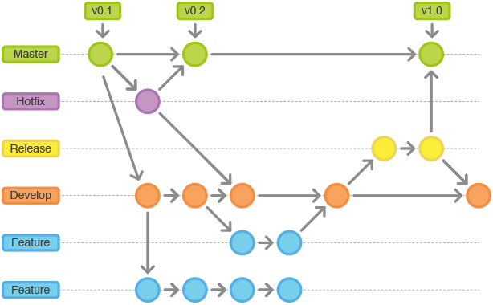

# Contribute using Git Flow

How to set up a branch, commit, and open a pull request following the conventions this repository actually
enforces.

## 1. Make sure Git is installed and up to date

```bash
git --version
```

## 2. Clone the repository and start from `develop`

```bash
git clone https://github.com/tuProlog/2p-kt.git
cd 2p-kt
git checkout develop
git pull
```

`develop` is the integration branch: new work branches off it and merges back into it. `master` tracks
released code.

## 3. Create a branch for your change

Name the branch after what it does, prefixed by its kind — this repository's history uses `feature/<name>`
(or the shorter `feat/<name>`) for new features and `fix/<name>` for bug fixes:

```bash
git checkout -b feature/my-new-thing
```



## 4. Commit using Conventional Commits

This repository enforces the [Conventional Commits](https://www.conventionalcommits.org/) format on every
commit message via a Git hook, configured in `settings.gradle.kts`:

```kotlin
--8<-- "settings.gradle.kts:50:53"
```

The hook is installed automatically the first time you let Gradle sync (`createHooks(true)`), so running any
Gradle task once (e.g. `./gradlew tasks`) after cloning is enough to activate it. A commit message that
doesn't start with a valid type — `feat:`, `fix:`, `chore:`, `docs:`, `refactor:`, `test:`, ... optionally
followed by `(scope)` and/or a `!` for breaking changes — will be rejected. For example:

```bash
git commit -m "feat: add support for XYZ"
git commit -m "fix(parser): handle empty clause bodies"
```

This matters beyond style: releases are cut automatically from these messages (via `semantic-release`), which
decides the next version number and changelog entry from the commit types you use.

## 5. Push your branch and open a pull request

```bash
git push -u origin feature/my-new-thing
```

Open the pull request against `develop` (not `master`), keep commits focused and reasonably small, and make
sure `./gradlew build` passes locally before requesting review.

## Useful resources

- [Conventional Commits specification](https://www.conventionalcommits.org/)
- [Atlassian: Gitflow Workflow](https://www.atlassian.com/git/tutorials/comparing-workflows/gitflow-workflow)
